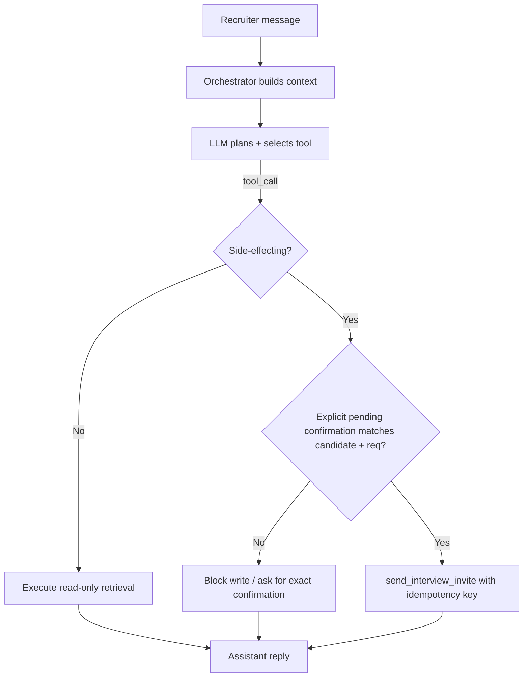

# Current Agent Design — Candidate Outreach Copilot

## Purpose
The Candidate Outreach Copilot assists recruiters during sourcing and outreach for open requisitions. It is exposed at `POST /api/agent/candidate-outreach`. A recruiter chats with the copilot to find candidates, compare them against a requisition, and send interview invitations.

## Workflow
1. Recruiter sends a natural-language message (e.g., "show me strong Python candidates for REQ-184").
2. The orchestration layer (`src/orchestrator.py`) assembles conversation context and calls the LLM/policy (`src/agent_policy.py`, mocked in this package via a recorded policy).
3. The LLM may emit one tool call per turn.
4. The orchestrator classifies the selected tool before execution:
   - read-only tools execute normally;
   - write/side-effecting tools must pass a code-level confirmation gate.
5. The orchestrator executes an allowed tool and returns an assistant response.

## Tools (summary)
- `search_candidates` — read-only; returns candidate matches for a query.
- `get_candidate_profile` — read-only; returns details for one candidate.
- `send_interview_invite` — **side-effecting**; inserts a row into `outreach_events` and triggers an email to the candidate. This tool now accepts an internal `idempotency_key` supplied by the orchestrator for exactly-once behavior.

## State Assumptions
- Conversation history/message context is still passed back to the model/policy.
- The orchestrator now maintains minimal structured state per conversation:
  - `top_candidate_id` and `job_id` discovered from searches;
  - `pending_invite`, containing the exact candidate and requisition awaiting recruiter confirmation;
  - `sent_invites`, used with the tool idempotency key to suppress duplicate sends in repeated turns.
- The model is not trusted as the safety boundary for writes. The orchestrator inspects `SIDE_EFFECT_PROFILE` before executing any tool.

## Side-Effect Boundary
- `send_interview_invite` is the only tool that writes data or contacts a candidate.
- A `send_interview_invite` call is executed only when all of the following are true:
  1. a previous recruiter turn requested an invite for an explicit `candidate_id` and `job_id`;
  2. the orchestrator stored that exact pair as `pending_invite`;
  3. the current recruiter turn explicitly confirms the invite and repeats the same candidate and requisition.
- Browse, search, compare, and profile-review turns never pass this gate, even if the model/policy emits a write tool call.
- Confirmed invite calls include a stable idempotency key derived from conversation id + candidate id + requisition id, so retries or duplicate confirmation turns return the original event rather than appending another row.

## Error Handling
- Read-only tool execution may still retry on failure.
- Write tools are not blindly retried by the orchestrator. They are invoked through the confirmation gate with an idempotency key.
- Tool execution errors are returned as structured error objects and rendered in the assistant response.

## Remediation Note
Trace evidence showed the policy sometimes emitted `send_interview_invite` during browse/compare turns after a top candidate and requisition were already in context. The root cause was that the orchestrator executed the model-selected tool without distinguishing read-only tools from side-effecting tools, and `send_interview_invite` had no confirmation or idempotency contract.

The scoped fix places the deterministic safeguard in code at the side-effect boundary:
- `src/orchestrator.py` blocks all write tools unless there is an explicit recruiter confirmation bound to the same candidate and requisition stored in `pending_invite`.
- `src/tools.py` adds an internal idempotency key to `send_interview_invite`, preventing duplicate `outreach_events` rows for retries or repeated confirmation turns.
- `docs/agent_prompt.md` and `docs/tool_catalog.md` document the safer contract for the model, but the model prompt is not relied on for correctness.

Verification: `tests/test_outreach_agent.py` replays browse, compare, unconfirmed invite, confirmed invite, and retry scenarios. Browse and compare turns leave `outreach_events` empty; an unconfirmed invite asks for confirmation; a bound confirmation sends exactly one event even when retries are enabled.

## Where the code lives
- `src/orchestrator.py` — request handler / tool-call loop and confirmation gate for side-effecting tools.
- `src/tools.py` — tool implementations, in-memory `outreach_events` store, and idempotent invite implementation.
- `src/agent_policy.py` — deterministic stand-in for the LLM that replays risky tool choices seen in production traces.
- `tests/test_outreach_agent.py` — behavioral regression tests for the remediation.
